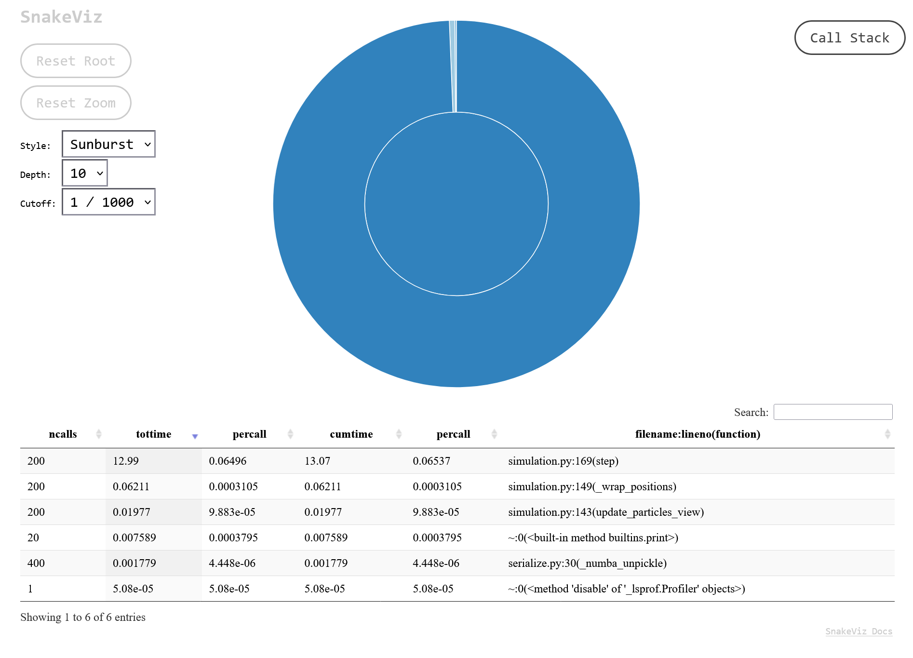
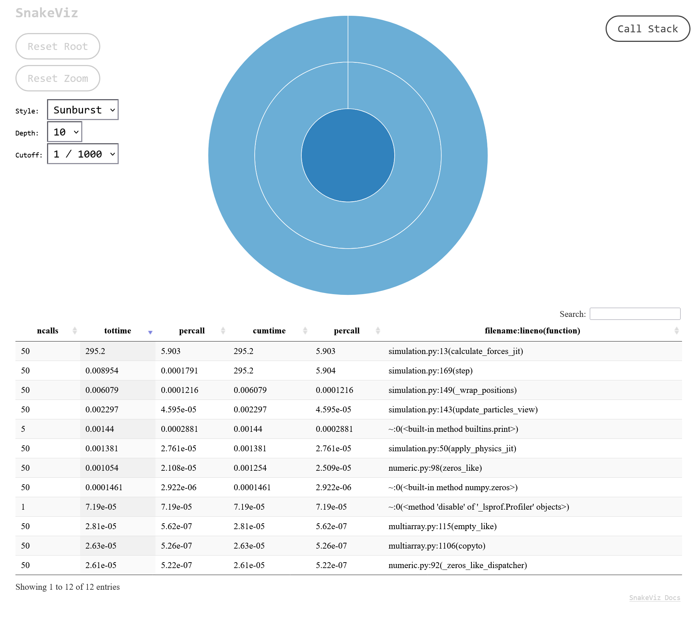
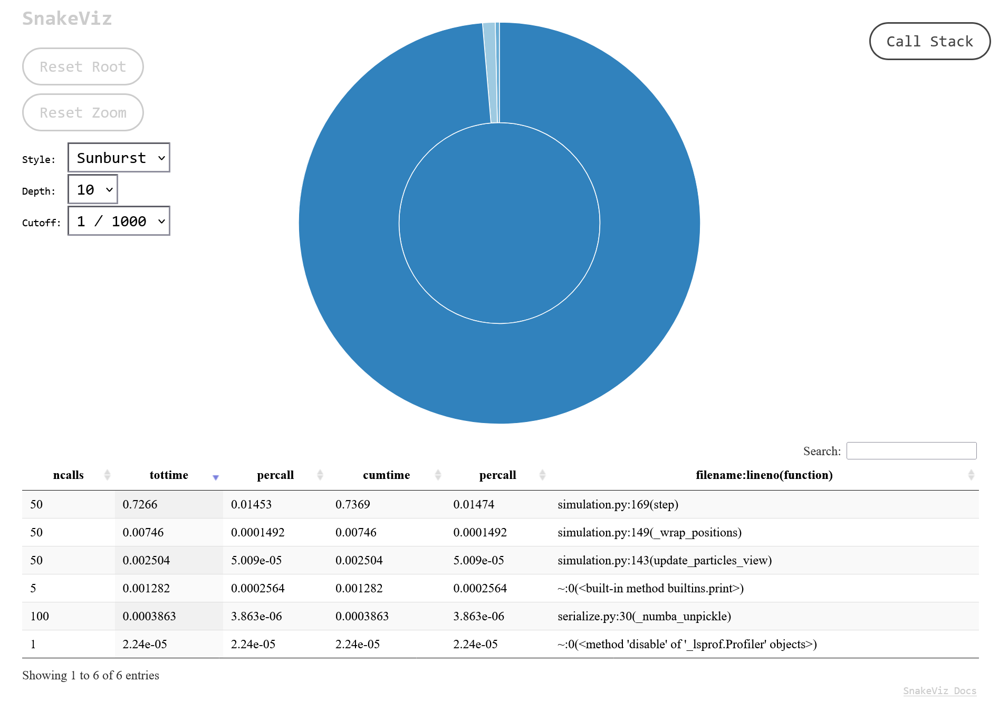

# Performance Profiling Report
This document details the performance optimization of the Particle Life Simulator, focusing on the impact of Numba JIT compilation and NumPy vectorization.

 # Benchmark Results
We conducted several benchmarks to compare the execution speed with and without Just-In-Time (JIT) optimization. All tests were performed with 2,000 particles.

| Configuration | Particles | Steps | Total Time | Simulation Speed (FPS) |
| :--- | :--- | :--- | :--- | :--- |
| **Pure Python** (No Numba) | 2,000 | 50 | 295.19s | **0.17 FPS** |
| **Optimized** (Numba JIT) | 2,000 | 50 | 0.74s | **67.94 FPS** |
| **Pure Python** (No Numba) | 2,000 | 200 | > 600s | < 0.1 FPS |
| **Optimized** (Numba JIT) | 2,000 | 200 | 3.28s | **61.50 FPS** |
| **Optimized** (Stress Test) | 4,000 | 200 | 13.08s | 15.29 FPS |

The transition from Pure Python to Numba JIT resulted in a performance boost of approx. 400x speedup (from 0.17 FPS to ~68 FPS). This optimization allows the simulator to handle thousands of particles in real-time.

## Benchmark Environment
The tests were conducted on the following hardware to ensure reproducibility:

* **OS:** Windows 10 Pro, Version 22H2 (Build 19045.6937)
* **Processor:** Intel(R) Core(TM) i5-7300U CPU @ 2.60GHz (Dual-Core, 4 Threads)
* **Memory:** 8.00 GB RAM (7.84 GB usable)
* **Graphics:** Intel(R) HD Graphics 620
* **Storage:** 238 GB SSD (Samsung MZVLW256)
* **Python Version:** 3.11 (Anaconda Environment)

# Bottleneck Analysis (cProfile)
Using cProfile, we identified that the calculate_forces_jit function was the primary bottleneck due to its O(n2) complexity.

The following table shows the top functions ordered by their cumulative execution time during a run of 200 steps with 2,000 particles (Optimized with Numba).

| Calls | Total Time | Per Call | Cumulative Time | Per Call (cum) | Function (Filename:Line) |
| :--- | :--- | :--- | :--- | :--- | :--- |
| 200 | 2.881s | 0.014s | 2.933s | 0.015s | `simulation.py:169(step)` |
| 200 | 0.028s | 0.000s | 0.028s | 0.000s | `simulation.py:149(_wrap_positions)` |
| 200 | 0.008s | 0.000s | 0.008s | 0.000s | `simulation.py:143(update_particles_view)` |

# Optimization Strategy
* **Numba @njit**: The force calculation loop (calculate_forces_jit) was decorated with @njit to compile it into machine code. This bypasses the Python interpreter's overhead for nested loops.

* **NumPy Vectorization**: We utilized NumPy arrays for particle positions and velocities to allow for contiguous memory access and efficient broadcasting.

* **JIT Warmup**: Since Numba compiles on the first call, we implemented a "Warmup Step" in our profiling script to ensure the benchmarks reflect the optimized execution speed rather than the compilation time.

## Alternative Approaches: cKDTree vs. JIT
During the development phase, we also evaluated the use of a **cKDTree** to optimize the neighbor search. Theoretically, this would reduce the algorithmic complexity from $O(n^2)$ to $O(n \log n)$.

* **Observation:** While the cKDTree significantly reduced the number of distance calculations, the overhead of rebuilding the tree structure in every single simulation step was substantial for our particle counts.
* **Performance Comparison:** At our target range of 2,000 particles the **Numba-optimized $O(n^2)$ approach** actually outperformed the cKDTree.
* **Conclusion:** We decided to stick with the Numba JIT implementation as it provided the most stable and highest Frame Rate (FPS) for the required particle density.

# Visualizing with Snakeviz
To reproduce the visual analysis:

    Run the profiler: python Profiling.py

    Open the visual report: snakeviz simulation.profile
